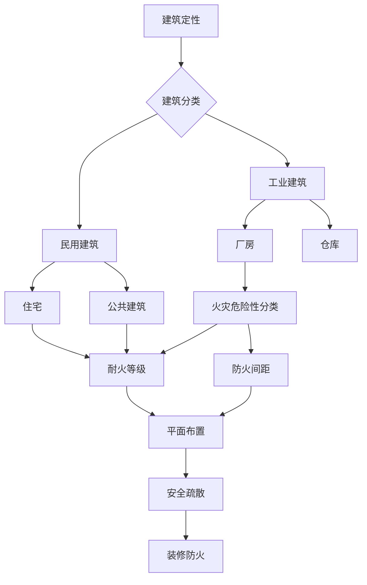

# 建筑防火 — 模块总览

## 知识脉络

## 板块定位

- **火灾危险性分类** → 决定建筑的定性，是后续所有设计的前提
- **耐火等级** → 决定构件燃烧性能和耐火极限要求
- **防火间距 / 平面布置** → 总平面布局与内部布置的防护措施
- **安全疏散** → 生命线设计，案例题必考
- **装修防火** → 燃烧性能和等级控制，常考材料等级

## 三合一关联

建筑防火是《实务》的重点，也是《综合》检测验收的对象，还是《案例》的场景设定。案例分析中必须先判断建筑定性，才能判断后续设施配置是否达标。

## 待填充条目

- fire-classification.md — 火灾危险性分类
- fire-resistance.md — 耐火等级
- site-layout.md — 总平面布局（防火间距）
- building-plane.md — 平面布置
- evacuation.md — 安全疏散
- decoration.md — 装修防火
