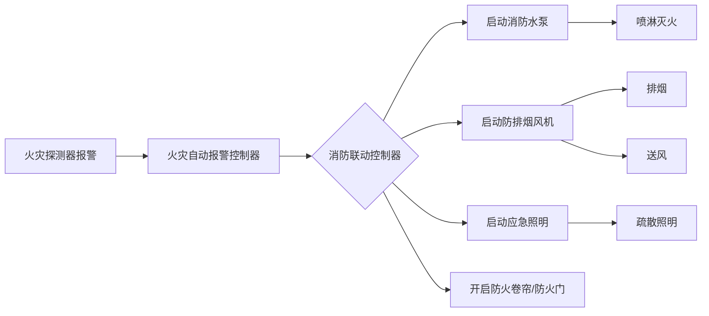

# 消防设施 — 模块总览

## 设施联动总览

## 三大板块

### 水系统（water/）
- 消防给水（water-supply.md）
- 消火栓系统（fire-hydrant.md）
- 自动喷水灭火系统（automatic-sprinkler.md）

### 电系统（electrical/）
- 火灾自动报警系统（alarm.md）
- 应急照明与疏散指示（emergency-lighting.md）

### 风系统（hvac/）
- 防排烟系统（smoke-control.md）

## 三合一关联

- **《实务》**。考系统组成、工作原理、设计参数
- **《综合》**。考安装、检测、调试、维护管理
- **《案例》**。考联动逻辑和故障分析（如湿式报警阀误动作原因排查）

## 消防设备代号辨识（竖向P102）

| 代号 | 含义 |
|---|---|
| XB7.8/20 | 工程用消防泵，额定压力0.78MPa，额定流量20L/s |
| XBC8.5/30GJ | 供水用途柴油机驱动，额定压力0.85MPa，额定流量30L/s，深井消防泵组 |
| JBQ8.0/10 | 汽油机驱动，额定压力0.80MPa，额定流量10L/s，手抬机动消防泵组 |
| SS/SA/SD/P/F/W/SN | 消火栓。地上/地下/折叠/泡沫/防撞/稳压/室内 |
| ZSFG 100-1.2C1 | C1型、减压式启动、1.2MPa、100mm，推杆型雨淋报警阀 |
| ZSFS 150-1.6J | 加压式启动、1.6MPa、150mm，活塞型雨淋报警阀 |
| ZSFY 100-1.2 | 100mm、1.2MPa 的预作用装置 |

## 消防设备安装高度汇总（竖向P98）

| 设备 | 安装高度 |
|---|---|
| 水箱支墩 / 自喷 / 室外消火栓 / 墙壁接合器 | 0.6m / 0.5m / 0.64m / 0.7m |
| 电动开门器 / 室内消火栓 | 0.9-1.3m / 1.1m |
| 报警阀组 | 1.2m |
| 细水雾分区控制阀 | 1.2-1.6m |
| 电话、手报、区域显示器 | 1.3-1.5m |
| 气体干粉选择阀 | 1.5-1.7m |
| 气体干粉手动启动装置中心点/手自动转换装置 | 1.5m |
| 泡沫灭火系统控制阀 | 1.1-1.5m，>1.8m 设板凳 |
| 灭火器 | 顶部≤1.5m，底部≥0.08m |
| 火灾报警控制器主显示屏 / 广播警报 | 1.5-1.8m / >2.2m |
| 照明灯具 | 不应在距地面 1m~2m 之间 |
| 标志灯具 | 室内≤3.5m 场所。底边 2.2m~2.5m；室内>3.5m 场所。特大型/大型/中型底边≥3m 且≤6m |

## 备用量全汇总（竖向P111）

| 系统 | 备用量要求 |
|---|---|
| 消火栓泵 | 工作泵≤3台（<54m住宅、室外≤25L/s且室内≤10L/s 可不设备用泵） |
| 喷淋泵 | 用1备1 或用2备1 |
| 稳压泵 | 用1备1 |
| 减压阀 | 每个供水分区≥2组、每组有备用 |
| 喷头 | 1%且≥10只每种规格 |
| 水喷雾喷头/细水雾喷头 | 1%且≥5只每种规格 |
| 七氟丙烷/IG541 | 72h 不能恢复 |
| CO₂ | ≥5个防护区或48h 不能恢复 |
| 干粉 | >5个防护区或48h 不能恢复 |
| 细水雾 | 48h 不能恢复 |
| 探测器 | 1% |
| 排烟窗易熔元件 | 10%且≥10个 |

## 高频联动考点（待补充）

- 探测器报警 → 联动启动水泵/风机的触发条件
- 手动 vs 自动控制方式的优先级
- 各类系统的启动信号来源

## 待填充条目

- fire-facilities/water/fire-hydrant.md
- fire-facilities/water/automatic-sprinkler.md
- fire-facilities/water/water-supply.md
- fire-facilities/electrical/alarm.md
- fire-facilities/electrical/emergency-lighting.md
- fire-facilities/hvac/smoke-control.md
