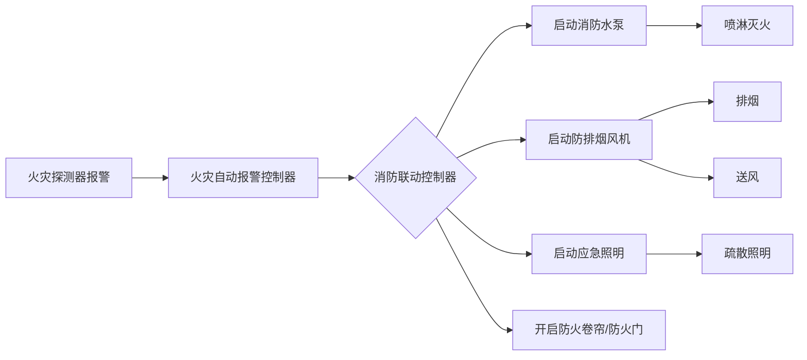

# 消防设施 — 模块总览

## 设施联动总览

## 三大板块

### 水系统（water/）
- 消防给水（water-supply.md）
- 消火栓系统（fire-hydrant.md）
- 自动喷水灭火系统（automatic-sprinkler.md）

### 电系统（electrical/）
- 火灾自动报警系统（alarm.md）
- 应急照明与疏散指示（emergency-lighting.md）

### 风系统（hvac/）
- 防排烟系统（smoke-control.md）

## 三合一关联

- **《实务》**。考系统组成、工作原理、设计参数
- **《综合》**。考安装、检测、调试、维护管理
- **《案例》**。考联动逻辑和故障分析（如湿式报警阀误动作原因排查）

## 高频联动考点（待补充）

- 探测器报警 → 联动启动水泵/风机的触发条件
- 手动 vs 自动控制方式的优先级
- 各类系统的启动信号来源

## 待填充条目

- fire-facilities/water/fire-hydrant.md
- fire-facilities/water/automatic-sprinkler.md
- fire-facilities/water/water-supply.md
- fire-facilities/electrical/alarm.md
- fire-facilities/electrical/emergency-lighting.md
- fire-facilities/hvac/smoke-control.md
