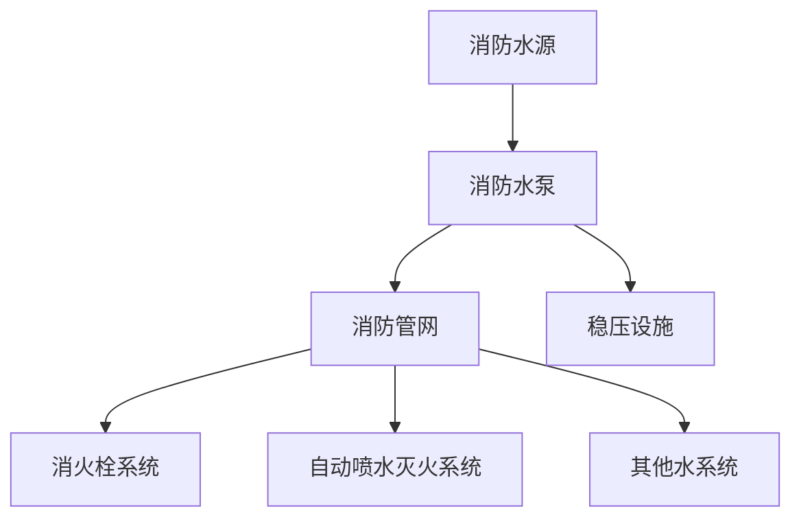

# 水系统 — 模块总览

## 水系统构成

## 三大子系统

| 系统 | 核心文件 | 关键考点 |
|---|---|---|
| 消防给水 | water-supply.md | 供水方式、水泵接合器、流量压力 |
| 消火栓 | fire-hydrant.md | 室内外消火栓、充实水柱、栓口压力 |
| 自动喷水灭火 | automatic-sprinkler.md | 湿式/干式/预作用/雨淋、喷头选型、报警阀组 |

## 三合一关联

- 水系统的启动逻辑（泵的启动方式：连锁启动 vs 联动启动）是案例题故障分析的高频考点
- 报警阀组的工作状态是《综合》检测验收的重点

## 待填充条目

- fire-hydrant.md
- automatic-sprinkler.md
- water-supply.md
