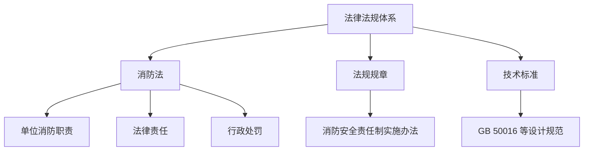

# 法律法规 — 模块总览

## 知识脉络

```mermaid
graph TD
    A[法律法规体系] --> B[消防法]
    A --> C[法规规章]
    A --> D[技术标准]
    B --> E[单位消防职责]
    B --> F[法律责任]
    B --> G[行政处罚]
    C --> H[消防安全责任制实施办法]
    D --> I[GB 50016 等设计规范]
```

## 板块定位

- **《消防法》**。基本职责划分、法律责任（罚款、责令停产停业等）
- **法规规章**。消防安全责任制实施办法、消防监督检查规定
- **技术标准**。各类设计、施工、验收规范（与知识库其他模块交叉引用）

## 待补充

- 高频法条记忆点（责任人、罚款金额、处罚机关）
- 法规与综合科目考题的对应关系
