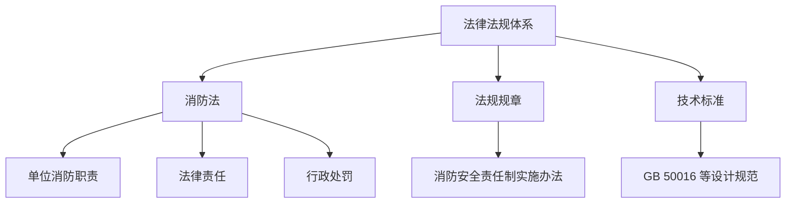

# 法律法规 — 模块总览

## 知识脉络

## 板块定位

- **《消防法》**。基本职责划分、法律责任（罚款、责令停产停业等）
- **法规规章**。消防安全责任制实施办法、消防监督检查规定
- **技术标准**。各类设计、施工、验收规范（与知识库其他模块交叉引用）

## 消防"8宗罪"（刑法，讲义224-233页）

立案标准统一为**1人死亡/3人重伤/100万直接损失**（失火罪为50万）。

| 罪名 | 立案/追诉标准 | 量刑 |
|---|---|---|
| **失火罪** | 1死/3重伤/**50万**/10户以上/森林过火2公顷 | 3-7年或3年以下 |
| **消防责任事故罪** | 100万 | 3年以下 / 3-7年 |
| **重大责任事故罪** | 100万 | 3年以下 / 3-7年 |
| **强令违章冒险作业罪** | 100万 | 5年以下 / 5年以上 |
| **重大劳动安全事故罪** | 100万 | 3年以下 / 3-7年 |
| **大型群众性活动重大安全事故罪** | 100万 | 3年以下 / 3-7年 |
| **工程重大安全事故罪** | 100万 | 5年以下并处罚金 / 5-10年 |
| **危险作业罪** | 3种客观要件，尚未发生事故即可定罪 | 1年以下 / 拘役 / 管制 |

## 消防技术服务机构从业条件（讲义238-239页）

| 机构类型 | 工作场所 | 注册消防工程师 | 消防设施操作员 |
|---|---|---|---|
| 维护保养检测机构 | ≥**200㎡** | ≥**2人**（技术负责人须一级） | ≥**6人**（中级以上≥**2人**） |
| 消防安全评估机构 | ≥**100㎡** | ≥**2人** | — |
| 两项并行 | ≥**200㎡** | ≥2人 | ≥**6人** |

**限制**。注册消防工程师不得同时在**2个以上**机构执业，不得在其他单位兼职。

## 注册消防工程师管理规定（讲义239-245页）

| 项目 | 规定 |
|---|---|
| 成绩滚动 | 一级**3年**、二级**2年** |
| 继续教育 | 每年≥**20学时**（法规职业道德≥4学时、技术标准≥12学时、安全管理≥4学时） |
| 执业业绩 | 服务机构每个注册有效期≥**3个**项目、消防安全重点单位每年≥**1个**技术文件 |
| 职业道德规范 | 爱岗敬业、依法执业、客观公正、公平竞争、保守秘密、奉献社会 |
| 根本原则 | 维护公共安全、诚实守信 |

### 不予注册8类情形（讲义338页，公安部令第143号第23条）

1. 年龄>**70周岁**或非完全民事行为能力人
2. 在非消防技术服务机构/非消防安全重点单位注册，或同时在**两个及以上**单位注册
3. 受刑事处罚未执行完毕，或因违法执业受刑事处罚执行完毕不满**5年**
4. 未达到继续教育、执业业绩要求
5. 被撤销注册不满**3年**
6. 注销注册（第55条第2项、第56条、第57条情形）不满**3年**
7. 注销注册（第55条第1项、第3项情形）不满**1年**
8. 行政处罚未履行完毕

## 消防安全评估检查项分级（讲义325页）

### 直接判定项A项（10种情形）
1. 未依法办理消防行政许可、备案
2. 未确定消防安全管理人
3. 疏散通道、安全出口数量不足或严重堵塞
4. 未按规定设置自动消防系统
5. 消防设施严重损坏
6. 人员密集场所违规使用、储存易燃易爆危险品
7. 违规采用易燃可燃装修材料
8. 责令改正后同一违法行为反复出现
9. 未建立专职消防队、志愿消防队
10. 一年内发生一次以上（含）较大火灾或两次以上（含）一般火灾

### 判定规则
- **A项**。直接判定为不合格（评估结论为"差"）
- **B项**（关键项）、**C项**（一般项）。按不合格项数量及权重综合判定（按评估标准执行）

## 待补充

- 高频法条记忆点（责任人、罚款金额、处罚机关）
- 法规与综合科目考题的对应关系
