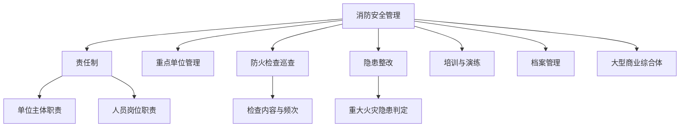

# 安全管理 — 模块总览

## 知识脉络

## 板块定位

安全管理主要来自《综合》科目，但在《案例》中与管理类问题结合考查。考点集中在

- 消防安全责任制的责任划分（单位负责人 vs 消防责任人 vs 岗位人员）
- 消防安全重点单位的界定与管理要求
- 防火检查、巡查的频次和内容
- 应急预案的编制与演练
- 大型商业综合体的消防安全管理（定义、职责、专职队/微型站）

## 待填充条目

- responsibility.md — 消防安全责任制
- inspection.md — 检查与维护
- commercial-complex.md — 大型商业综合体
